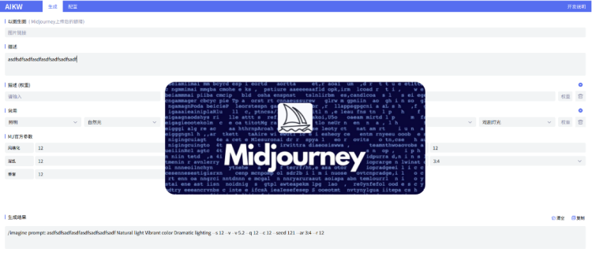

# AIKW

AIKW是一款辅助AI生成图像的关键词输出工具。由私人团队开发完成, 完成开源免费, 不定期更新迭代。

它默认集合了Midjourney的常用关键词及设置后缀命令, 可以高效的帮你一键式生产图像关键词,  大大缩短了流程。

后续版本中将扩展自定义默认关键词, 常用词组记忆等功能, 让你一站式完成AI生产的准备工作。

目前已发布的版本中:  核心支持Midjourney。

## 快速入门

1. 在 [ 描述 ] 模块可进行主要的关键词输入,  AIKW会实时进行中文关键词翻译
2. 在 [ 常用 ] 模块中, 内置了基本的绘画描述关键词进行选择, 如灯光、 材质、风格等
3. 在 [ MJ官方参数 ] 模块中, 内置了Midjourney的对应配置, 可根据需求进行选择
4. 输入选择好了关键词后  可在 [ 生成 ] 模块进行关键词复制, 后在Midjourney中粘贴使用
